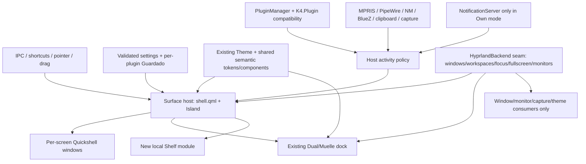

# Proposed architecture — after source audit, no code changed

This proposal extends the existing k4 structure. `shell.qml` already owns arbitration; `PluginManager` already owns instances; `Island` already publishes geometry; `Dual` already implements a dock. Introducing duplicate hosts, plugin registries, or state stores would make migration riskier. The architecture and v1 direction are approved; implementation still requires approval. See [source audit](RESEARCH_K4.md) and [design-system contract](UX_DIRECTION.md#practical-qml-design-system-layer).

## Layers and ownership

- **UI/design-system layer:** existing `core/Theme.qml`, `core/Island*`, `widgets/`, `api/K4/Tema.qml` and plugin `*View.qml` remain the basis. Add semantic type/spacing/radius/icon/elevation/color/motion/focus roles and dark/light/reduced-motion resolution to the existing theme and shared components early. Preserve public theme properties for old plugins; do not add a second theme singleton. First-party modules touched for v1 adopt shared roles; external plugins remain compatible. Settings stays a separate window; capture/editor/fullscreen tools retain their own surfaces when focus or geometry requires them.
- **Surface system:** one host model determines `mode`, screen, edge, compact geometry, expansion geometry, exclusive zone, visibility and focus. Initially implemented within/refactored from `shell.qml`, `services/Island.qml`, `services/Settings.qml` and `plugins/Dual`. A new `SurfaceController` module is justified only when code extraction reduces the present cross-file state coupling and tests can cover its rules. Do not add a window manager framework for geometry that Quickshell already supplies.
- **System services:** keep `services/Media`, `Audio`, `Wifi`, `Bt`, `Notifs`, `Clipboard`, `Captura`, `Archivos`, `Fondos`, etc. Event-driven Quickshell services stay in use. Helpers stay where subprocesses have a real benefit (clipboard watcher, ffmpeg, file search); a large new daemon is not required. A new brightness HUD requires a verified device signal. Suspend hidden visualizers/animations, avoid duplicate watchers, and measure polling before changing it. Common Linux services remain outside `CompositorBackend`.
- **Notification ownership:** `services/Notifs.qml` currently creates Quickshell `NotificationServer` and `shell.qml` eagerly initializes it. In v1 the host must choose **Own** (claim `org.freedesktop.Notifications`, enable toast/history/actions) or **External/off** (do not register the server, keep other surface functions, show notification features unavailable). Preserve the `Notifs` singleton API as a safe facade because host and inherited plugins reference it directly; guard its history/action paths in External mode. An existing swaync/mako/dunst owner must not be killed or silently displaced. No passive cross-daemon history/action adapter is evidenced by the freedesktop protocol; see [D20](DECISIONS.md#d20-detail--notification-ownership). Detect name conflicts and owner changes in installation/runtime QA before promising graceful switching.
- **Local file/clipboard workflows:** Shelf owns staged references and a small file-action contract (open, reveal, copy path, remove, safe copy/drag-out); reuse `services/Archivos.qml` helpers where suitable. Clipboard keeps its text/image watcher/store and gains UI polish first. File-reference clipboard offers are a separate MIME/security feasibility item, not a reason to redesign storage upfront.
- **Plugins:** `services/PluginManager.qml` remains catalog/lifecycle owner. `api/K4/Plugin.qml`, `K4.Puente`, `K4.Ipc`, `K4.Ajustes`, `K4.Guardado` and existing manifest keys remain a compatibility contract. New optional contribution roles can be additive after compatibility tests: `compactActivity`, `expandedActivity`, `dockItem`, `backgroundProvider`, `actions`, `settingsPage`. Do not make old `view` plugins invalid; map them to the primary expanded slot. The current manifest permission list is disclosure and static checking, not a sandbox. Show that honestly at enable/install time.
- **IPC:** retain `k4` compatibility verbs in `shell.qml` and plugin targets such as `k4.launcher`. New mode/Shelf commands can be additive. IPC response/error behavior should be specified and tested rather than silently ignoring missing plugins. Any eventual product-name change can add aliases after a migration window.
- **Persistence/settings:** retain existing state paths, stable settings section IDs, IPC aliases and plugin files for compatibility. Regroup UI by user intent without duplicating persisted values. Add versioned/validated surface settings with migration from `posicionBarra`, `alineacionBarra`, `reservaIsla` and `Dual` saved settings; keep backup/last-good behavior where PluginManager already has it. Shelf stores local references/metadata with atomic writes and retention rules, not duplicated original files by default. Respect XDG paths where feasible, with a documented migration.

## Activity policy: extend existing arbitration

Current basis: `shell.qml:34-109` picks highest `active`/`priority`, closes transients when a user view wins, and publishes occupant/open to `Island`; `api/K4/Plugin.qml` provides `transitorio`, focus and hover rules. The **Host Activity Policy** extends this arbitration inside the existing host. It is not a new independent service or second state owner.

| Field | Proposed meaning |
| --- | --- |
| `id`, `source`, `screenHint` | Stable activity identity, producer and requested display. |
| `kind` | `background`, `persistent`, `transient`, or `userSession`. |
| `priorityBand` | Policy bands: emergency/critical, explicit user session, privacy/recording, transient HUD/notification, persistent media, idle. Numeric legacy plugin priority maps into a band/order; exact mapping is tested, not guessed. |
| `createdAt`, `expiresAt`, `dismissed` | Lifetime and deterministic expiry; a transient can expire while hidden rather than reappear stale. |
| `compact`, `expanded`, `actions` | Optional contribution data/view factories; old plugin `view` fills expanded and current pill indicators remain compatible. |
| `interruptible`, `restorable` | Whether another activity may temporarily take the primary seat, and whether prior state returns. |

The host holds one global ordered set of eligible activities and selects **one primary expanded view**, with a screen hint for where to show it. Compact persistent badges may coexist if their provider supports it; verified recording state remains accessible even while another primary view is open. Broader privacy detection is later unless a reliable source is established. Brief volume activity may replace media, expire, then media resumes if still playing; notification activity joins **only in Own mode**. An explicit launcher/file/settings session outranks automatic transients. A critical battery alert can preempt only under a documented critical rule, with an accessible dismissal path. Events arriving behind a user session are coalesced or, in Own mode, logged in notification history; avoid stale popup backlogs. “Queue” is a bounded pending event list, not every media tick. Existing plugin booleans remain lifecycle truth until an adapter is proven; no parallel `active` flag is introduced. V1 customization: category visibility, brief duration, preferred monitor and reduced motion; arbitrary numeric priority editing is later.

Restore on state changes, not fixed timeout guesses: if volume expires, recompute from current media/recording/plugin state. Coalesce rapid volume/network changes; expire hidden transients instead of replaying stale HUDs. When a monitor disappears, rehome to a surviving screen, clear stale geometry, and return focus. Separate **activity selection** from **surface mode**: the same event can show in Notch/Island/Hybrid, while Dock mode uses a small status affordance and keeps the dock's task role. Hover previews do not take keyboard focus; deliberate click/shortcut views may. The activity policy need not model every UI hover as a second lifecycle system.

## Hyprland backend seam

Do **not** wrap all Qt or Quickshell objects. A narrow `CompositorBackend` is justified because source imports and commands already spread across `Workspaces`, `Ventanas`, `Notifs`, `Captura`, `Dual`, `Atalaya`, `Pantallas` and `HyprTheme`. Its first implementation is `HyprlandBackend`, potentially as QML services plus existing helper commands. Contract candidates: monitor identities/geometry/scale, focused monitor, fullscreen/workspace state, toplevel enumeration and app identity, focus/activate/close, window thumbnails capability, reserved-space/layer capability and compositor configuration actions. Return capability flags and explicit errors. Theme/monitor configuration remains Hyprland-only feature modules; do not force generic methods for them. The Quickshell `PanelWindow` layer-shell surface itself stays in the surface layer unless a future compositor proves it needs a different adapter.

Do not introduce `DesktopBackend`, `WindowManagerBackend` and `CompositorBackend` simultaneously. One `CompositorBackend` around the concrete repeated seams is enough. Keep MPRIS, PipeWire, NetworkManager, BlueZ and local files outside it. No Niri/KDE/GNOME backend is included in v1.

The v1 surface relies on Quickshell's `PanelWindow` backed by the **`zwlr_layer_shell_v1` protocol extension on Hyprland**, not a universal core Wayland layer surface. DnD itself uses core `wl_data_device`; clipboard history needs compositor-supported data-control beyond focus-limited core selection. Screenshot/cast portals are distinct D-Bus interfaces, not layer-shell or screencopy. See [PORTABILITY.md](PORTABILITY.md).

The privacy boundary is likewise explicit: **no telemetry in Notchbar core**. Current weather/IP geolocation, Open-Meteo, media URL artwork, Anthropic usage calls and optional Digivice imagery are network-capable; enabled QML plugins run in-process and are not sandboxed by manifest checks. Keep these features disclosed/controllable where practical and avoid describing the entire application as network-free. See [source audit](RESEARCH_K4.md#quality-privacy-and-performance-findings).

## Tests at architectural seams

Pure policy tests for activity selection/expiry/restoration and settings migration; fixture-driven parsers for Hyprland monitor/client payloads; IPC command response tests; plugin lifecycle/compatibility test using `ejemplos/hola` and a failing sample; Shelf file-URI and missing-file semantics; one/two-monitor Hyprland integration scripts; rendered visual/accessibility checks. The existing Python validators remain gates. Avoid trying to unit-test pixel-perfect QML animation; use rendered screenshots/video plus frame/resource traces for those claims.
